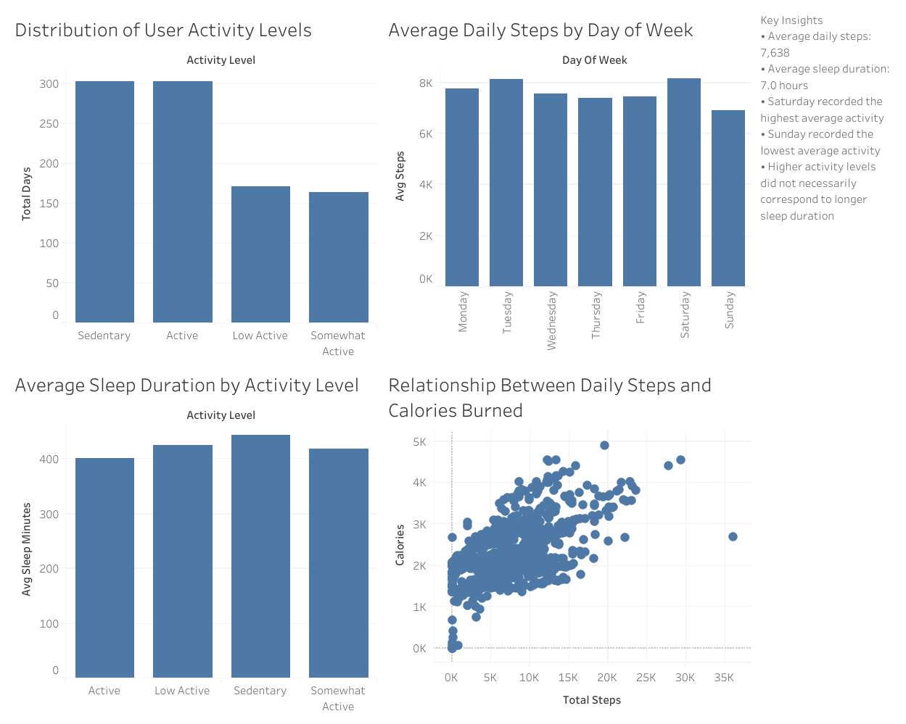

# 🩺 Bellabeat Fitness Tracker Analysis

## 📌 Project Overview

This project analyzes Bellabeat smart device fitness data to identify user activity patterns, sleep behavior, and wellness trends. The analysis was performed using Google BigQuery for data cleaning and SQL analysis, while Tableau was used to build an interactive dashboard.

The objective is to generate actionable business recommendations that can help Bellabeat improve user engagement and support data-driven marketing strategies.

---

## 🎯 Business Task

Analyze smart device usage data to identify trends in physical activity and sleep behavior and provide recommendations that support Bellabeat's marketing strategy.

---

## 🛠 Tools Used

- Google BigQuery
- SQL
- Tableau
- GitHub

---

## 📂 Dataset

Bellabeat FitBit Fitness Tracker Dataset (Kaggle)

---

## 🔎 Data Cleaning

The following data quality checks were performed:

- Imported datasets into Google BigQuery
- Removed duplicate sleep records
- Checked for missing values
- Joined activity and sleep datasets
- Validated data integrity

---

## 📊 Exploratory Data Analysis

The analysis focused on:

- User activity levels
- Average daily steps
- Calories burned
- Sleep duration
- Activity versus sleep relationship
- Weekly activity trends

---

## Dashboard



---

## 📌 Key Findings

### 👣 Activity

- Average daily steps: **7,638**
- Users recorded both highly active and sedentary days.
- Saturday showed the highest activity levels.
- Sunday showed the lowest activity levels.

---

### 😴 Sleep

- Average sleep duration: **7.0 hours**
- Average time in bed: **7.6 hours**
- Users spent approximately **39 minutes awake while in bed**.

---

### 🔥 Calories

Higher daily step counts were associated with increased calories burned.

---

### 💤 Activity vs Sleep

More active users did not necessarily sleep longer than less active users.

---

## 💡 Business Recommendations

### 1. Encourage Daily Activity

Introduce personalized step goals, reminders, and achievement badges to increase daily activity.

### 2. Increase Sunday Engagement

Launch weekend challenges and motivational notifications to improve activity levels on Sundays.

### 3. Promote Holistic Wellness

Promote activity tracking and sleep monitoring together, recognizing that higher activity levels do not automatically result in longer sleep duration.

---

## 📁 Repository Structure

```text
sql/
tableau/
images/
README.md
```

---

## 🚀 Skills Demonstrated

- SQL
- BigQuery
- Data Cleaning
- Exploratory Data Analysis (EDA)
- Data Visualization
- Dashboard Design
- Business Analysis
- Data Storytelling

---

## 👤 Author

GitHub:
https://github.com/halartha483-cmyk
